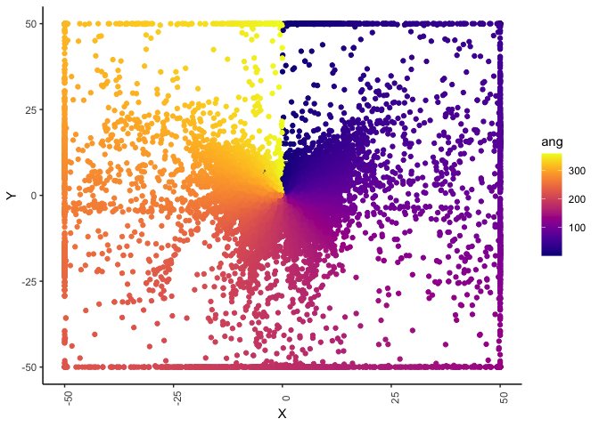
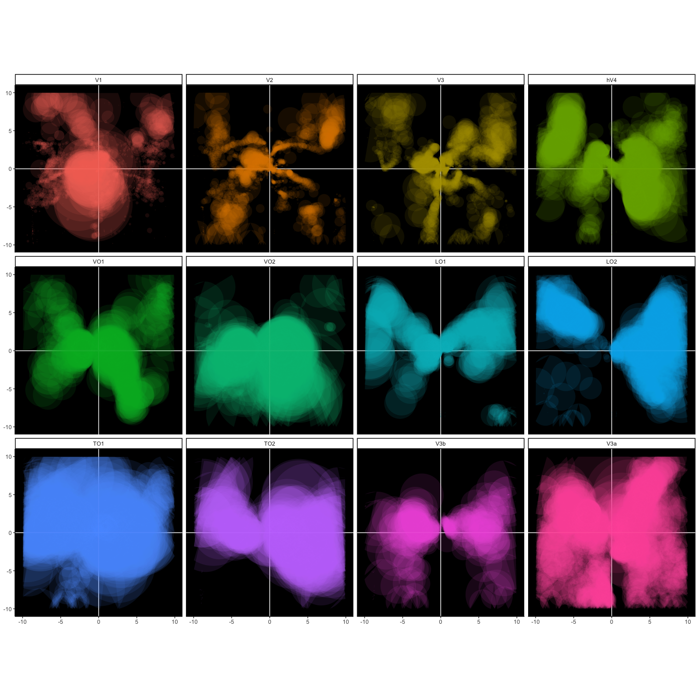
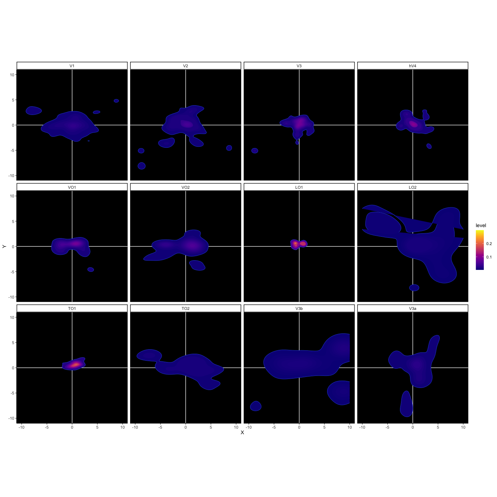
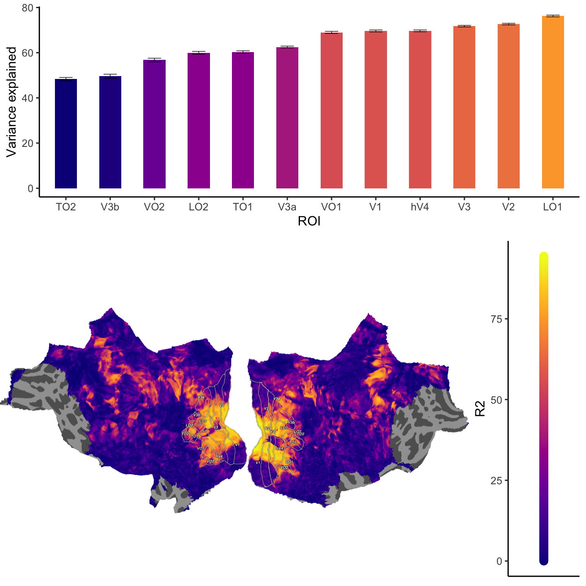
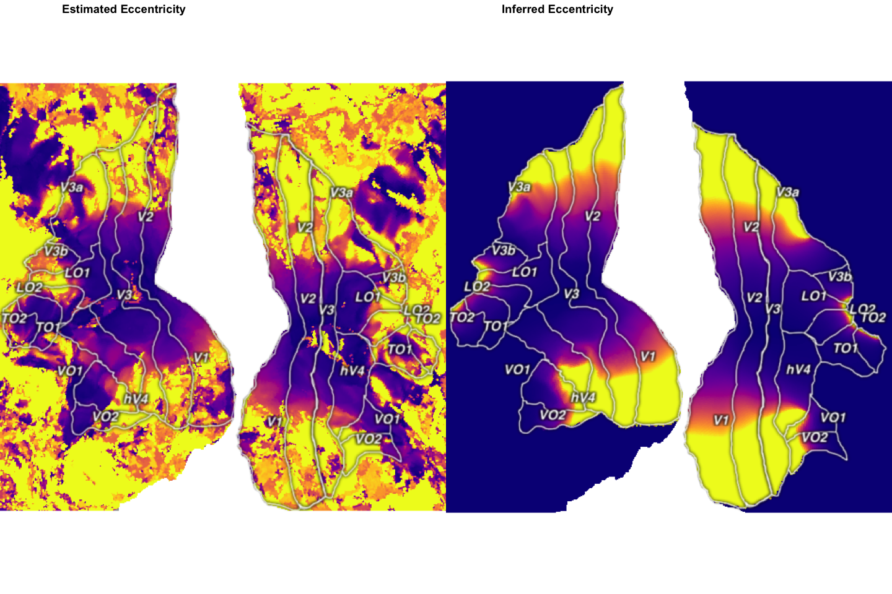
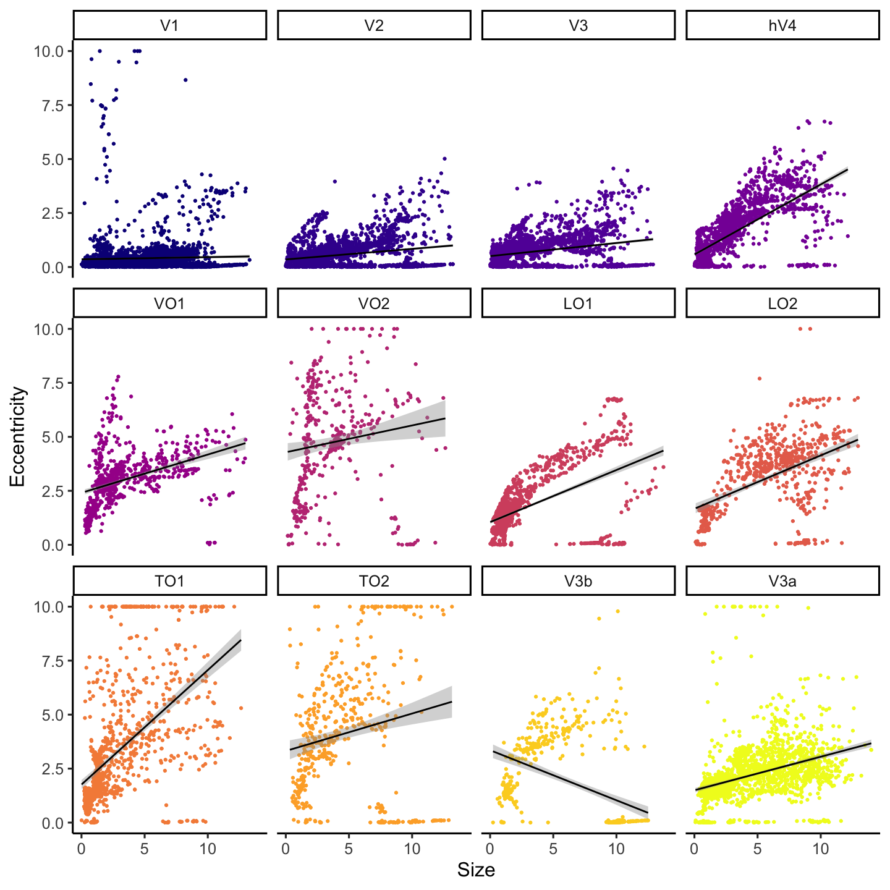
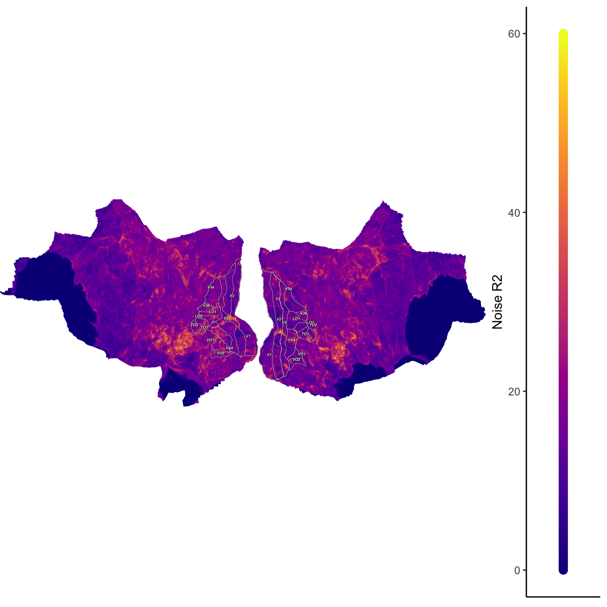

# Index

| Section | Description | Status |
| --- | --- | --- |
| [Data summary](#data) | Summary of data |
| [Noise](#mfit) | General accounting/ cleaning the data to exclude noise |
| [Coverage](#cov) | Plots of visual field coverage |
| [R2](#r2) | Variance explained plots |
| [Sigma](#sig) | Sigma plots |
| [Eccentricity](#ecc) | Eccentricity plots |
| [Eccentricity x Size](#eccs) | Relationship between size and eccentricity  |
| [Polar angle](#ang) | Polar angle plots  |
| [Noise](#Noise) | Plot that shows fit of the noise model  |
| [Percent Signal Change](#psc) | Gif of psc change over time  |


# Imports


```r
library(ggplot2)
library(ggforce)
library(mixtools)
```

```
## mixtools package, version 1.2.0, Released 2020-02-05
## This package is based upon work supported by the National Science Foundation under Grant No. SES-0518772.
```

```r
library(cowplot)
```

```
## 
## ********************************************************
```

```
## Note: As of version 1.0.0, cowplot does not change the
```

```
##   default ggplot2 theme anymore. To recover the previous
```

```
##   behavior, execute:
##   theme_set(theme_cowplot())
```

```
## ********************************************************
```

```r
library(kableExtra)
library(stringr)
library(pracma)
library(viridis)
```

```
## Loading required package: viridisLite
```


<a id='data'></a>

# Data summary

Below is the dataset:


<div style="border: 1px solid #ddd; padding: 0px; overflow-y: scroll; height:300px; overflow-x: scroll; width:900px; "><table class="table table-striped table-hover table-condensed" style="width: auto !important; ">
<caption>Data</caption>
 <thead>
  <tr>
   <th style="text-align:right;position: sticky; top:0; background-color: #FFFFFF;"> X.1 </th>
   <th style="text-align:right;position: sticky; top:0; background-color: #FFFFFF;"> R2 </th>
   <th style="text-align:right;position: sticky; top:0; background-color: #FFFFFF;"> sigma </th>
   <th style="text-align:right;position: sticky; top:0; background-color: #FFFFFF;"> isigma </th>
   <th style="text-align:right;position: sticky; top:0; background-color: #FFFFFF;"> ecc </th>
   <th style="text-align:right;position: sticky; top:0; background-color: #FFFFFF;"> iecc </th>
   <th style="text-align:right;position: sticky; top:0; background-color: #FFFFFF;"> ang </th>
   <th style="text-align:right;position: sticky; top:0; background-color: #FFFFFF;"> iang </th>
   <th style="text-align:right;position: sticky; top:0; background-color: #FFFFFF;"> X </th>
   <th style="text-align:right;position: sticky; top:0; background-color: #FFFFFF;"> Y </th>
   <th style="text-align:right;position: sticky; top:0; background-color: #FFFFFF;"> ROI </th>
   <th style="text-align:right;position: sticky; top:0; background-color: #FFFFFF;"> idx </th>
   <th style="text-align:right;position: sticky; top:0; background-color: #FFFFFF;"> Hemisphere </th>
  </tr>
 </thead>
<tbody>
  <tr>
   <td style="text-align:right;"> 0 </td>
   <td style="text-align:right;"> 27.695471 </td>
   <td style="text-align:right;"> 10.0000000 </td>
   <td style="text-align:right;"> 0 </td>
   <td style="text-align:right;"> 4.8539120 </td>
   <td style="text-align:right;"> 0 </td>
   <td style="text-align:right;"> 303.8647 </td>
   <td style="text-align:right;"> 0 </td>
   <td style="text-align:right;"> -4.0304727 </td>
   <td style="text-align:right;"> 2.7047647 </td>
   <td style="text-align:right;"> 0 </td>
   <td style="text-align:right;"> 0 </td>
   <td style="text-align:right;"> 1 </td>
  </tr>
  <tr>
   <td style="text-align:right;"> 1 </td>
   <td style="text-align:right;"> 56.418604 </td>
   <td style="text-align:right;"> 2.4727238 </td>
   <td style="text-align:right;"> 0 </td>
   <td style="text-align:right;"> 0.6329298 </td>
   <td style="text-align:right;"> 0 </td>
   <td style="text-align:right;"> 163.5531 </td>
   <td style="text-align:right;"> 0 </td>
   <td style="text-align:right;"> 0.1791997 </td>
   <td style="text-align:right;"> -0.6070318 </td>
   <td style="text-align:right;"> 0 </td>
   <td style="text-align:right;"> 1 </td>
   <td style="text-align:right;"> 1 </td>
  </tr>
  <tr>
   <td style="text-align:right;"> 2 </td>
   <td style="text-align:right;"> 4.057080 </td>
   <td style="text-align:right;"> 0.5649345 </td>
   <td style="text-align:right;"> 0 </td>
   <td style="text-align:right;"> 30.4843764 </td>
   <td style="text-align:right;"> 0 </td>
   <td style="text-align:right;"> 271.5453 </td>
   <td style="text-align:right;"> 0 </td>
   <td style="text-align:right;"> -30.4732891 </td>
   <td style="text-align:right;"> 0.8221032 </td>
   <td style="text-align:right;"> 0 </td>
   <td style="text-align:right;"> 2 </td>
   <td style="text-align:right;"> 1 </td>
  </tr>
  <tr>
   <td style="text-align:right;"> 3 </td>
   <td style="text-align:right;"> 1.943642 </td>
   <td style="text-align:right;"> 1.1748822 </td>
   <td style="text-align:right;"> 0 </td>
   <td style="text-align:right;"> 50.3402546 </td>
   <td style="text-align:right;"> 0 </td>
   <td style="text-align:right;"> 173.3346 </td>
   <td style="text-align:right;"> 0 </td>
   <td style="text-align:right;"> 5.8430497 </td>
   <td style="text-align:right;"> -50.0000000 </td>
   <td style="text-align:right;"> 0 </td>
   <td style="text-align:right;"> 3 </td>
   <td style="text-align:right;"> 1 </td>
  </tr>
  <tr>
   <td style="text-align:right;"> 4 </td>
   <td style="text-align:right;"> 44.977633 </td>
   <td style="text-align:right;"> 10.0000000 </td>
   <td style="text-align:right;"> 0 </td>
   <td style="text-align:right;"> 28.1751645 </td>
   <td style="text-align:right;"> 0 </td>
   <td style="text-align:right;"> 326.0413 </td>
   <td style="text-align:right;"> 0 </td>
   <td style="text-align:right;"> -15.7385219 </td>
   <td style="text-align:right;"> 23.3696132 </td>
   <td style="text-align:right;"> 0 </td>
   <td style="text-align:right;"> 4 </td>
   <td style="text-align:right;"> 1 </td>
  </tr>
  <tr>
   <td style="text-align:right;"> 5 </td>
   <td style="text-align:right;"> 1.031232 </td>
   <td style="text-align:right;"> 1.5382633 </td>
   <td style="text-align:right;"> 0 </td>
   <td style="text-align:right;"> 52.3031763 </td>
   <td style="text-align:right;"> 0 </td>
   <td style="text-align:right;"> 107.0665 </td>
   <td style="text-align:right;"> 0 </td>
   <td style="text-align:right;"> 49.9999999 </td>
   <td style="text-align:right;"> -15.3499922 </td>
   <td style="text-align:right;"> 0 </td>
   <td style="text-align:right;"> 5 </td>
   <td style="text-align:right;"> 1 </td>
  </tr>
</tbody>
</table></div>

Also define the images, and a function for making viridis colorbars (this code block should be hidden). 


Set up some constants.


```r
nROIS=length(unique(myfile$ROI))
facetval=floor(sqrt(nROIS))
recipe=list(scale_fill_manual(values=c("steelblue2","springgreen3")),theme_classic(),theme(axis.text.x = element_text(angle = 90)))


ROILABS=c("None","V1","V2","V3","hV4","VO1","VO2","LO1","LO2","TO1","TO2","V3b","V3a")

myfile$ROI=factor(myfile$ROI,levels=c(0:12),labels=ROILABS)
```


<a id='mfit'></a>

# Noise

To try and parse between signal and noise, I fit a gaussian mixture model to the distribution of R2 values. 


```r
library(mixtools)
out<-normalmixEM(myfile$R2[!is.na(myfile$R2)],k=2)
```

```
## number of iterations= 48
```


Use this to define a threshold, whereby there is a low probability that the voxel belongs to the noise pool. Plot this.


```r
thresh=out$mu[1]+(1.96*out$sigma[1])

myfile$noisesep=factor(ifelse(myfile$R2<thresh,0,1),levels=c(0,1),labels=c("noise","signal"))

varex=ggplot(data = myfile,aes(x = R2))+geom_histogram(color="black",aes(fill=noisesep),binwidth=.005, position="identity")+geom_vline(xintercept=thresh)+recipe
varex
```

```
## Warning: Removed 66365 rows containing non-finite values (stat_bin).
```

<!-- -->


Now view this as a function of ROI


```r
varexROI=ggplot(data = myfile[myfile$ROI!="None",],aes(x = R2))+geom_histogram(color="black",aes(fill=noisesep),binwidth=.01, position="identity")+geom_vline(xintercept=thresh)+facet_wrap(~ROI,nrow=facetval)+recipe
varexROI
```

<!-- -->

Now, additionally determine the voxels that are tuned to the screen.


```r
myfile$onscreen=rep(0,nrow(myfile))

myfile$onscreen=ifelse(myfile$X>-10 & myfile$X<10 &  myfile$Y>-10 & myfile$Y<10,1,0)
```


Show position of prfs in relation to the screen.


```r
ggplot(data=myfile[myfile$ROI!="None",],aes(x=X,y=Y))+geom_rect(xmin=-10,xmax=10,ymin=-10,ymax=10)+geom_point(aes(colour=onscreen))+recipe
```

<!-- -->


```r
ggplot(data=myfile[myfile$ROI!="None",],aes(x=X,y=Y))+geom_rect(xmin=-10,xmax=10,ymin=-10,ymax=10)+geom_point(aes(colour=ang))+recipe+scale_colour_viridis(option='plasma')
```

<!-- -->


```r
ggplot(data=myfile[myfile$ROI!="None",],aes(x=X,y=Y))+geom_rect(xmin=-10,xmax=10,ymin=-10,ymax=10)+geom_point(aes(colour=noisesep))+recipe
```

<!-- -->


Before anything else, do some general accounting to determine the number of noisy/offscreen voxels in each ROI.

<div style="border: 1px solid #ddd; padding: 0px; overflow-y: scroll; height:300px; overflow-x: scroll; width:900px; "><table class="table table-striped table-hover table-condensed" style="width: auto !important; ">
<caption>ROI summary</caption>
 <thead>
  <tr>
   <th style="text-align:left;position: sticky; top:0; background-color: #FFFFFF;">   </th>
   <th style="text-align:right;position: sticky; top:0; background-color: #FFFFFF;"> N vertices </th>
   <th style="text-align:right;position: sticky; top:0; background-color: #FFFFFF;"> PropNoise </th>
   <th style="text-align:right;position: sticky; top:0; background-color: #FFFFFF;"> PropOffscreen </th>
   <th style="text-align:right;position: sticky; top:0; background-color: #FFFFFF;"> Mrsquared </th>
  </tr>
 </thead>
<tbody>
  <tr>
   <td style="text-align:left;"> None </td>
   <td style="text-align:right;"> 297241 </td>
   <td style="text-align:right;"> 0.6359041 </td>
   <td style="text-align:right;"> 0.6366664 </td>
   <td style="text-align:right;"> 1029.805 </td>
  </tr>
  <tr>
   <td style="text-align:left;"> V1 </td>
   <td style="text-align:right;"> 7328 </td>
   <td style="text-align:right;"> 0.4138919 </td>
   <td style="text-align:right;"> 0.2969432 </td>
   <td style="text-align:right;"> 2130.317 </td>
  </tr>
  <tr>
   <td style="text-align:left;"> V2 </td>
   <td style="text-align:right;"> 5822 </td>
   <td style="text-align:right;"> 0.3083133 </td>
   <td style="text-align:right;"> 0.3689454 </td>
   <td style="text-align:right;"> 4541.016 </td>
  </tr>
  <tr>
   <td style="text-align:left;"> V3 </td>
   <td style="text-align:right;"> 4253 </td>
   <td style="text-align:right;"> 0.2031507 </td>
   <td style="text-align:right;"> 0.2976722 </td>
   <td style="text-align:right;"> 6686.414 </td>
  </tr>
  <tr>
   <td style="text-align:left;"> hV4 </td>
   <td style="text-align:right;"> 2058 </td>
   <td style="text-align:right;"> 0.0442177 </td>
   <td style="text-align:right;"> 0.0782313 </td>
   <td style="text-align:right;"> 7286.004 </td>
  </tr>
  <tr>
   <td style="text-align:left;"> VO1 </td>
   <td style="text-align:right;"> 946 </td>
   <td style="text-align:right;"> 0.0073996 </td>
   <td style="text-align:right;"> 0.2082452 </td>
   <td style="text-align:right;"> 6950.166 </td>
  </tr>
  <tr>
   <td style="text-align:left;"> VO2 </td>
   <td style="text-align:right;"> 830 </td>
   <td style="text-align:right;"> 0.0445783 </td>
   <td style="text-align:right;"> 0.5084337 </td>
   <td style="text-align:right;"> 5926.769 </td>
  </tr>
  <tr>
   <td style="text-align:left;"> LO1 </td>
   <td style="text-align:right;"> 1741 </td>
   <td style="text-align:right;"> 0.0063182 </td>
   <td style="text-align:right;"> 0.2004595 </td>
   <td style="text-align:right;"> 7886.712 </td>
  </tr>
  <tr>
   <td style="text-align:left;"> LO2 </td>
   <td style="text-align:right;"> 1067 </td>
   <td style="text-align:right;"> 0.0037488 </td>
   <td style="text-align:right;"> 0.3683224 </td>
   <td style="text-align:right;"> 6219.818 </td>
  </tr>
  <tr>
   <td style="text-align:left;"> TO1 </td>
   <td style="text-align:right;"> 1354 </td>
   <td style="text-align:right;"> 0.0901034 </td>
   <td style="text-align:right;"> 0.1964549 </td>
   <td style="text-align:right;"> 5826.597 </td>
  </tr>
  <tr>
   <td style="text-align:left;"> TO2 </td>
   <td style="text-align:right;"> 1010 </td>
   <td style="text-align:right;"> 0.3356436 </td>
   <td style="text-align:right;"> 0.3554455 </td>
   <td style="text-align:right;"> 3329.027 </td>
  </tr>
  <tr>
   <td style="text-align:left;"> V3b </td>
   <td style="text-align:right;"> 1006 </td>
   <td style="text-align:right;"> 0.1998012 </td>
   <td style="text-align:right;"> 0.4423459 </td>
   <td style="text-align:right;"> 3825.895 </td>
  </tr>
  <tr>
   <td style="text-align:left;"> V3a </td>
   <td style="text-align:right;"> 3028 </td>
   <td style="text-align:right;"> 0.0465654 </td>
   <td style="text-align:right;"> 0.3738441 </td>
   <td style="text-align:right;"> 5609.348 </td>
  </tr>
</tbody>
</table></div>


Now get rid of the noisy voxels.


```r
myfile_denoised=myfile[myfile$noisesep=="signal",]
myfile_denoised=na.omit(myfile_denoised)

myfile_denoised=myfile_denoised[myfile_denoised$ROI!="None",]

myfile_denoised=myfile_denoised[myfile_denoised$onscreen==1,]
```

<a id='cov'></a>

# Coverage

Show visual field coverage, but this time confined to the screen.


Also plot as a function of ROI.


```r
cov1=ggplot()+geom_hline(yintercept=0,colour='white')+
theme_classic()+theme(panel.background = element_rect(fill='black'))+geom_vline(xintercept=0,colour='white')+geom_circle(alpha=.1,data=myfile_denoised,mapping=aes(x0=X,y0=Y,r=sigma/2,fill=ROI,alpha=.1),colour='transparent')+xlim(-10,10)+ylim(-10,10)+coord_fixed()+facet_wrap(~ROI,nrow=facetval)+ theme(legend.position="bottom")+theme(legend.position = "None")+scale_colour_viridis(discrete = TRUE,option='plasma')

cov1
```

<!-- -->


```r
ggplot(myfile_denoised, aes(x = X, y = Y))+xlim(-10,10)+ylim(-10,10)+geom_hline(yintercept=0,colour='white')+geom_vline(xintercept=0,colour='white')+coord_fixed()+theme_classic()+theme(panel.background = element_rect(fill='black')) +geom_density_2d()+facet_wrap(. ~ROI,nrow=facetval) + stat_density_2d(aes(fill = after_stat(level)), geom = "polygon")+ scale_fill_viridis(option='plasma')
```

<!-- -->


<a id='r2'></a>

# Variable summaries: R2


```r
R2plot=ggplot(myfile_denoised,aes(x = reorder(ROI, R2, FUN = mean),y=R2))+theme_classic(base_size=24)+stat_summary(fun = mean, geom = "bar", width = 0.5,aes(fill=..y..))+stat_summary(fun.data = mean_se, geom = "errorbar", width = 0.3)+ theme(legend.position="bottom")+xlab("ROI")+ylab("Variance explained")+ scale_fill_viridis_c(option='plasma',begin=0,end = 0.8)+theme(legend.position = "None")


plot_grid(R2plot,R2c,nrow = 2,rel_heights = c(0.4,0.6))
```

<!-- -->

<a id='sig'></a>

# Variable summaries: Sigma


```r
Splot=ggplot(myfile_denoised,aes(x = reorder(ROI, sigma, FUN = mean),y=sigma))+theme_classic(base_size=24)+stat_summary(fun = mean, geom = "bar", width = 0.5,aes(fill=..y..))+stat_summary(fun.data = mean_se, geom = "errorbar", width = 0.3)+ theme(legend.position="none")+xlab("ROI")+ylab("Sigma")+ scale_fill_viridis_c(option='plasma',begin=0,end=0.5)

plot_grid(Splot,Sc,nrow = 2,rel_heights = c(0.4,0.6))
```

<!-- -->


## Inferences


```r
Sestimate
```

<!-- -->


<a id='ecc'></a>


# Variable summaries: Eccentricity


```r
Eplot=ggplot(myfile_denoised,aes(x = reorder(ROI, ecc, FUN = mean),y=ecc))+theme_classic(base_size=24)+stat_summary(fun = mean, geom = "bar", width = 0.5,aes(fill=..y..))+stat_summary(fun.data = mean_se, geom = "errorbar", width = 0.3)+ theme(legend.position="none")+xlab("ROI")+ylab("Eccentricity")+ scale_fill_viridis_c(option='plasma',begin=0,end=0.3)


plot_grid(Eplot,Ec,nrow = 2,rel_heights = c(0.4,0.6))
```

<!-- -->


## Inferences


```r
Eestimate
```

<!-- -->


<a id='eccs'></a>

# Variable summaries: Eccentricity x sigma


```r
SEplot=ggplot(myfile_denoised,aes(x = ecc,y=sigma))+recipe+geom_point(aes(color=ROI))+ theme(legend.position="bottom")+theme_classic(base_size=24)+geom_smooth(method='lm',colour='black')+facet_wrap(~ROI,nrow=facetval)+xlab("Size")+ylab("Eccentricity")+scale_colour_viridis(discrete = TRUE,option='plasma')+ theme(legend.position="none")

SEplot
```

```
## `geom_smooth()` using formula 'y ~ x'
```

<!-- -->


<a id='ang'></a>

# Variable summaries: Polar angle


```r
polplot=ggplot(myfile_denoised, aes(x = ang)) +
  geom_histogram(binwidth = 15, aes(fill=..x..)) +
  scale_x_continuous(breaks = seq(0, 360, 60))+theme_classic(base_size=24)+
  coord_polar(start=deg2rad(0),direction=1)+facet_wrap(~ROI,nrow=2)+ theme(legend.position="bottom")+ scale_fill_viridis_c(option='plasma')+theme(legend.position = "None")


plot_grid(polplot,Ac,nrow = 2,rel_heights = c(0.5,0.6))
```

<!-- -->


## Inferences


```r
Aestimate
```

<!-- -->


<a id='Noise'></a>

# Fit of noise model


```r
Nc
```

<!-- -->

<a id='psc'></a>

# Percent signal change.


{width=900px}


